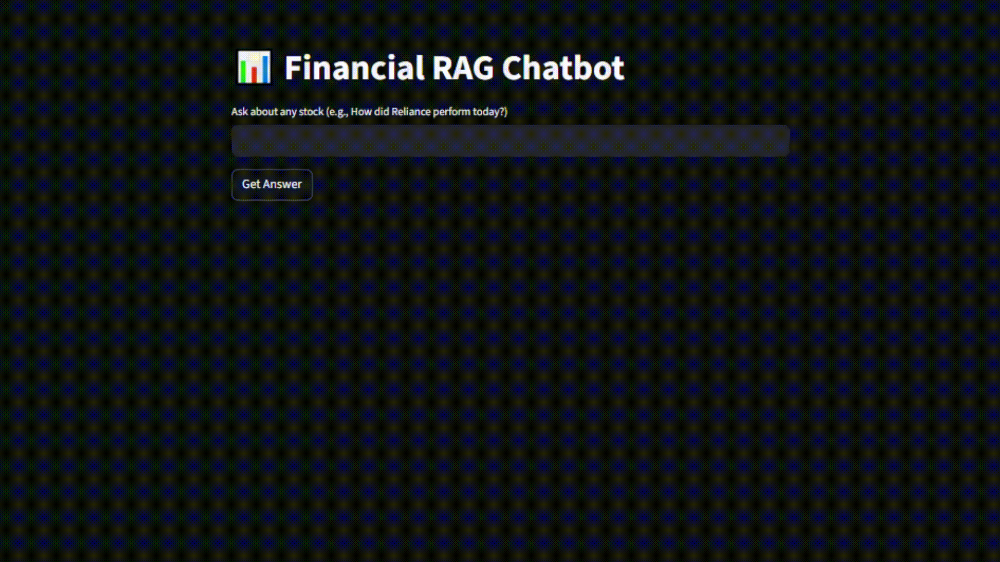

# FinAssistant 💹🤖

A real-time financial chatbot that answers natural-language queries using live data from the Indian stock market (NSE/BSE), powered by LLaMA 3 via Groq Cloud.



---

## 🚀 Features

- 📈 Real-time stock data (NSE)
- 🔍 Ask questions like:
  - "How did Reliance perform today?"
  - "Top volume stocks today?"
- 🧠 LLaMA3 for natural language responses
- 📊 Uses bhavcopy and MarketWatch data
- 🛠️ Built with open-source tools

---

## 🧰 Tech Stack

- [Groq Cloud](https://console.groq.com/) + [LLaMA 3](https://llama.meta.com/)
- [`nselib`](https://pypi.org/project/nselib/) for market data
- `pandas` for data analysis
- `Python 3.10+`
- (Planned) Streamlit frontend

---

## 🔧 Setup Instructions

```bash
# 1. Clone the repo
git clone https://github.com/yourusername/FinAssistant.git
cd FinAssistant

# 2. Create virtual environment (optional but recommended)
python -m venv venv
source venv/bin/activate  # or venv\Scripts\activate on Windows

# 3. Install dependencies
pip install -r requirements.txt

# 4. Run the bot
python app.py
